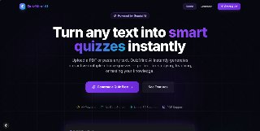
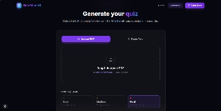
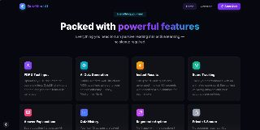

# QuizMind AI 🧠

> **AI-powered quiz generator** that transforms PDFs or text into interactive multiple-choice quizzes using the **Google Gemini AI** (free API).



## ✨ Features

| Feature | Details |
|---|---|
| 📄 **PDF Upload** | Drag-and-drop PDF parsing (up to 10 MB) |
| ✍️ **Text Input** | Paste raw text, study notes, or articles |
| 🤖 **AI Generation** | Google Gemini 1.5 Flash (FREE tier) |
| 🎯 **Difficulty Levels** | Easy · Medium · Hard |
| 📊 **Score Tracking** | Animated score ring + accuracy stats |
| 📝 **Answer Explanations** | AI-generated explanation per question |
| 🔁 **Quiz History** | Last 10 sessions saved to localStorage |
| ⌨️ **Keyboard Navigation** | Press 1–4 to answer, ← → to navigate |
| 📤 **Export Results** | Download JSON results file |
| 🌙 **Dark Mode** | Beautiful dark-first design by default |
| ♿ **Accessible** | Full ARIA labels and focus management |

---

## 🚀 Quick Start

### Prerequisites

- **Node.js** 18.17 or later
- **Google Gemini API key** — [Get free key here](https://aistudio.google.com/app/apikey) (no credit card!)

### 1. Clone & Install

```bash
git clone https://github.com/your-username/quizmind-ai.git
cd quizmind-ai
npm install
```

### 2. Configure Environment

```bash
# Set up your FREE Gemini API key
cp .env.local.example .env.local
# Then open .env.local and replace the placeholder:
# GEMINI_API_KEY=your_key_here
#
# Get a free key (30 seconds, no credit card):
# https://aistudio.google.com/app/apikey:

```env
GEMINI_API_KEY=your_gemini_api_key_here
```

> ⚠️ **Never commit `.env.local`** to version control. It is in `.gitignore`.

### 3. Run Locally

```bash
npm run dev
```

Open [http://localhost:3000](http://localhost:3000) in your browser.

---

## 🌐 Deploy to Vercel

1. Push your repository to GitHub.
2. Go to [vercel.com](https://vercel.com) → **New Project** → import your repo.
3. In **Environment Variables**, add:
   - `GEMINI_API_KEY` = your free Gemini API key
4. Click **Deploy**.

> The app is configured for Vercel with a 60-second function timeout for long PDF generation.

---

## 🗂️ Project Structure

```
quizmind-ai/
├── app/
│   ├── api/generate-quiz/    # Secure POST endpoint (Claude + PDF)
│   ├── generate/             # Quiz generator page
│   ├── quiz/                 # Active quiz page
│   ├── results/              # Results & review page
│   ├── layout.tsx            # Root layout
│   └── page.tsx              # Landing page
├── components/
│   ├── ui/                   # Button, Card, Badge, Skeleton
│   ├── layout/               # Navbar, Footer
│   ├── landing/              # HeroSection, FeaturesSection
│   ├── generate/             # FileUploadZone, TextInputArea, Settings
│   ├── quiz/                 # QuestionCard, ProgressBar, Timer
│   └── results/              # ScoreCard, QuestionReview, Export
├── hooks/
│   ├── useQuiz.ts            # Derived quiz state
│   └── useTimer.ts           # Session timer
├── lib/
│   ├── claude.ts             # Claude API client (retry + sanitise)
│   ├── pdf-parser.ts         # Server-side PDF extraction
│   ├── validators.ts         # File & text validation
│   └── utils.ts              # Helper functions
├── store/
│   └── quizStore.ts          # Zustand + localStorage persistence
└── types/
    └── quiz.ts               # TypeScript interfaces
```

---

## ⚙️ Tech Stack

| Layer | Technology |
|---|---|
| Framework | Next.js 15 (App Router) |
| Language | TypeScript (strict) |
| Styling | Tailwind CSS v3 |
| Animations | Framer Motion |
| State | Zustand + localStorage |
| AI | Google Gemini 1.5 Flash (`@google/generative-ai`) — FREE |
| PDF Parsing | `pdf-parse` |
| Toasts | Sonner |
| Icons | Lucide React |

---

## 🔒 Security

- API key is **server-side only** — never exposed to the client
- File uploads are validated by **type** and **size** (max 10 MB)
- Text inputs are **length-validated** before hitting the API
- Claude responses are **sanitised** before JSON parsing
- No user data is stored on the server

---

## 🧪 Development

```bash
# Start dev server
npm run dev

# Build for production
npm run build

# Run lint
npm run lint

# Start production server
npm start
```

---

## 📸 Screenshots

### Generate your quiz easily


### Packed with powerful features


---

## 📄 License

MIT — see [LICENSE](LICENSE) for details.
